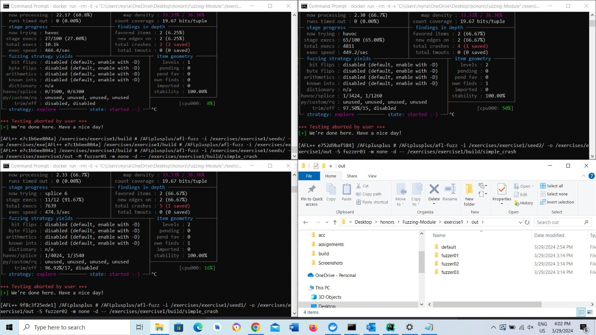

# Honors Final Report 
**Authors:** Darius Floroiu, Myriam Guranda

**Supervisor**: Professor Sicco Verwer

[Google Doc Version of Report](https://docs.google.com/document/d/1G8DFGDWeCFvvJaVB0-TxvMYBuCKBEcHEqYRPOG5iAzY/edit?usp=sharing)


## Abstract
This report presents a tutorial on fuzzing and AFL++ and our two-year honors research on improving its effectiveness. In the first year, we identified AFL++’s struggles with string-based inputs and used Cppcheck to detect vulnerable functions, exploring control flow analysis to guide fuzzing. In the second year, we focused on runtime analysis, implementing dynamic control flow graph (CFG) construction, and examining AFL++’s bitmap mechanism. By modifying LLVM-instrumented binaries to log block node IDs, we gained insights into coverage tracking. Our findings set up the grounds for enhancing fuzzing precision and execution flow analysis, addressing key AFL++ limitations.

## Introduction
Fuzz testing is a key technique for discovering software vulnerabilities, with AFL++ being one of the most widely used tools. However, AFL++ has some limitations, such as the lack of native targeted fuzzing,  or poorly-documented flags. 
This paper provides a tutorial on AFL++ and explores techniques to enhance its effectiveness. We discuss its challenges in fuzzing string-based inputs, the role of static analysis in guiding fuzzing, and methods for improving runtime execution tracking. Additionally, we examine AFL++’s bitmap mechanism and control flow graph (CFG) construction to better understand its coverage feedback. Our findings aim to help users maximize AFL++’s potential and improve fuzzing precision.
To better understand fuzzing and different fuzzing techniques, we recommend reading the first chapters of [The Fuzzing Book – Fuzzer](https://www.fuzzingbook.org/html/Fuzzer.html).

## AFL++ Introduction
AFL++ is an improved version of the AFL (American Fuzzy Lop) fuzzer, built for finding bugs and security vulnerabilities in software. It works by feeding programs with random inputs and using feedback from execution to generate new test cases that explore different paths in the code. Compared to the original AFL, AFL++ adds better mutation strategies, faster execution modes, and more flexible instrumentation options. It’s widely used in security research and software testing to uncover crashes, memory issues, and unexpected behavior. Its goal is to automate and speed up the process of finding flaws before attackers do. ([Fuzzing Approach](https://aflplus.plus/docs/afl-fuzz_approach/#:~:text=AFL%2B%2B%20is%20a%20brute,changes%20to%20program%20control%20flow.)) 

 AFL is a gray-box fuzzer, meaning it expects instrumentation to measure code coverage to have been injected into the target program at compile time and uses the coverage metric to direct the generation of new inputs. ([Wikipedia page on AFL](https://en.wikipedia.org/wiki/American_Fuzzy_Lop_(software)#:~:text=As%20described%20above%2C%20AFL%20is,many%20subsequent%20gray%2Dbox%20fuzzers. ))

## Targeted Fuzzing
Instead of randomly exploring the program's entire input space, targeted fuzzing is a software testing technique that focuses on creating inputs that are specifically made to exercise specific areas or behaviors within a program. By efficiently reaching and testing predefined target locations in the code, this method seeks to more effectively find potential bugs or vulnerabilities, as described by Wüstholz and Christakis in their paper "Targeted greybox fuzzing with static lookahead analysis"([Wüstholz and Christakis, 2020](https://doi.org/10.1145/3372297.3423352)).

Targeted fuzzing entails employing a variety of techniques to direct the fuzzing process toward these particular code regions. One popular approach is to use static analysis techniques, which examine the program's structure without running it and find the routes that lead to the desired destinations. The fuzzer uses these paths to determine how to change inputs in order to direct execution.

While AFL++ does not natively support targeted fuzzing, we explored foundational steps toward enabling it by identifying vulnerable functions via static analysis with Cppcheck,  attempting to configure allowlist-based instrumentation using LLVM or modifying the instrumentation code. These methods, discussed in the next sections, represent early progress toward making AFL++ more focused and directed in its fuzzing process.

## How to Use AFL++

A helpful guide to run AFL++  we used was https://github.com/alex-maleno/Fuzzing-Module/tree/main, especially Phases 1 and 2, which describe the Setup and how to fuzz a program. 
In summary, these are the steps that should be followed, if you decided using Docker Container:

#### _**First run**_: 

1. docker pull aflplusplus/aflplusplus

2. docker images

3. Run docker container:

    a . docker run -it <image id>

   b. make (optional - not needed every time)

   c. close terminal

   d. docker ps

   e. docker commit <CONTAINER ID> (printed from previous step)


   **NB**:  From now on, to not repeat these steps multiple times, you can just use the same Commit sha every time you run the tool, but, once you close the container, your changes will not remain saved! For better usage, you can follow this page to make the connection between your IDE and Docker. 
   

4. Start container:
   docker run --rm -it -v "path to code (for Fuzzing-Module in our case - in quotation marks)":/exercises <first 8-12 digits of the sha resulted by command 3.e.> (**for example, docker run --rm -it -v "C:\Users\dariu\Desktop\Fuzzing-Module":/exercises <sha>**)


5.   Start actual fuzzing:

   **a**. cd .. (you are now in /AFLplusplus)

   **b**. cd exercises (common exercises folder)

   **c**. cd exercise1 (or any exercise number)

   **d**. mkdir build (create build directory)

   **e**. cd build (go to build directory)

   **f**. CC=/AFLplusplus/afl-cc CXX=/AFLplusplus/afl-c++ cmake .. (create make file)  OR CC=/AFLplusplus/afl-clang-fast CXX=/AFLplusplus/afl-clang-fast++ cmake ..     
   
   **g**. make (to create the executable)

   **h**. cd .. (now in exercise1 directory)

   **i**. mkdir seeds (create seeds directory)

   **j**. cd seeds (go to seeds directory)

   **k**. for i in {0..4}; do dd if=/dev/urandom of=seed_$i bs=64 count=10; done (or create seed files manually)
  
**l**.  cd .. (to be in the exercise1 directory, not mandatory)
   
**m**. /AFLplusplus/afl-fuzz -i [full path to your seeds directory] -o out -m none -d -- [full path to the executable] (run the fuzzer on the executable) (e.g. /AFLplusplus/afl-fuzz -i seeds/ -o out -m none -d build/simple_crash)

**Tips to avoid redundancy or issues:** 

 1) If you do not modify the code you want to run afl on, and you already created your executable ( in this case found in exercises/exercise1/build/simple_crash), you don’t need to do steps f-l every time you run the fuzzer. But, if you want to modify the compiler used (in step f), you wil need to run f, g. 
2) If you change either of the codes ( afl or the target code), you need to run make on either the afl directory ( if you changed the afl code) or in the target code directory( if you changed that one), so that the binary gets rebuilt ( sometimes, even make clean and then make).

Running the above should give you something similar to this. The tool will run until you end it with Ctrl+C.


Figure 1: Example of AFL++ output

Learning more about what these outputs mean can be done [here](https://afl-1.readthedocs.io/en/latest/user_guide.html) but they will also be briefly discussed in the next section. 

More tutorials can be found at https://aflplus.plus/docs/tutorials/. 


## Workflow -Main Idea
Here are some helpful links for understanding the main idea of how afl++ works:
https://github.com/AFLplusplus/AFLplusplus/blob/stable/src/README.md 
https://blog.ritsec.club/posts/afl-under-hood/


The main entry point is in the afl-fuzz.c. 


Here we also have the calls to the fuzz_one(afl) function, which executes one mutation, using as parameter a pointer to the current afl state:


The main fuzzing procedure keeps mutating until one fuzz is skipped. Then, if no new coverage is found for some significant time, we switch to exploitation strategy - using the test cases we already have created:


The generation of new mutants happens in the afl-fuzz-one.c file. First, a random number is generated, which corresponds to a mutation. Then, using a switch statement, the mutation which corresponds to this number is applied to the buffer. The number is generated on line 2195, and the mutation happens between lines 2197 and 3272:


As we saw in Figure 1, we have multiple output types that we can use to better understand the code. They are found in afl-fuzz-stats.c, and are built in the afl-fuzz-bitmap.c. These outputs can also be viewed in the out folder :


In AFL++, the **queue** stores **test cases** that have been found to be **interesting** based on code coverage feedback ( done in the save_if_interesting method in afl-fuzz-bitmap.c) ..Specifically, the queue holds:

1. Newly discovered inputs that trigger new execution paths in the target binary.

2. Mutated test cases that resulted in novel coverage or execution behavior.

3. Crashing test cases (if they cause a segmentation fault, buffer overflow, or other exceptions).

4. Hanging test cases (if execution time exceeds a defined timeout).

5. The crashes can be found in the crashes folder, but pay attention to the information you find in the files, because the file contents may not fully represent the crash itself. For instance, if you want crashes to be strings of 1 character only, you may find in the crashes folder both a “c” and a “c” followed by an empty space. 


The **bitmap** is discussed in the following sections.


## Multithreading

AFL++ supports multithreading to speed up fuzzing by running multiple instances in parallel. Each instance can explore different paths and mutations, increasing overall coverage and efficiency. The multithreading is implemented in the afl-fuzz.c file, where the main function creates multiple threads, each running an instance of the fuzzer.
How to do it?

a) All threads should target the same output file, e.g. “out”
b) After the file name, run the -M or -S flag, depending on whether it is the main process or a secondary one.
c) After -M (or -S), we need to add the name of the folder where the crashes will be saved for each run. The names should be different.
d) Open multiple terminal sessions and run the modified command, eg:
      1. /AFLplusplus/afl-fuzz -i /exercises/exercise1/seeds/ -o out -M fuzzer01 -m none -d -- /exercises/exercise1/build/simple_crash
      2. /AFLplusplus/afl-fuzz -i /exercises/exercise1/seeds/ -o out -S fuzzer02 -m none -d -- /exercises/exercise1/build/simple_crash
In the picture below, we show an example: how to do multithreading. For fuzzers 2 and 3, we use different seed files. Fuzzer 1 will contain all the crashes (it is used for synchronization), while fuzzers 2 and 3 will only contain the crash that they found.


## Using Static Analysis Tools
Cppcheck (https://cppcheck.sourceforge.io/ ) is a static analysis tool used for detecting vulnerable functions in your program. It can detect bugs like memory leaks, out-of-bounds calls


Example on how we used Cppcheck to get vulnerable functions and their “location”, and other functions in the vulnerable ones, that could trigger new crashes:
problematic_files.py:
```python
import json
import os
import subprocess


current_directory = os.getcwd()


c_cpp_files = []


for root, dirs, files in os.walk(current_directory):
    for file in files:
        if file.lower().endswith(('.c', '.cpp', '.h', '.hpp', '.cc', '.cxx', '.hh', '.hxx')):
            file_path = os.path.join(root, file)
            c_cpp_files.append(file_path)


for file in c_cpp_files:
    completed = subprocess.run([
            "cppcheck",
            "--enable=all",
            "--inline-suppr",
            "--suppress=missingInclude",
            "--force",
            '--template={file}:{line}',
            file
        ],
        check=True,
        capture_output=True
    )


    lines = completed.stderr.decode("utf-8")


    if lines == "":
        continue


    ctags_output = subprocess.run([
            "ctags",
            "--c-kinds=f",
            "--fields={name}{line}{end}",
            "--output-format=json",
            "--sort=no",
            file,
        ],
        check=True,
        capture_output=True
    ).stdout.decode("utf-8")


    functions = []
    for c in ctags_output.splitlines():
        info = json.loads(c)
        functions.append({
            "name": info["name"],
            "start_line": int(info["line"]),
            "end_line": int(info["end"])
        })


    printed_functions = set()
    stack = []


    function_code_map = {}
    for function in functions:
        func_name = function["name"]
        start_line = function["start_line"]
        end_line = function["end_line"]


        function_code = subprocess.run([
                "sed", "-n", f"{start_line},{end_line}p", file
            ],
            check=True,
            capture_output=True
        ).stdout.decode("utf-8")


        # Store the function code in the map with a (file, function_name) key
        function_code_map[(file, func_name)] = function_code


    for function in functions:
        func_name = function["name"]
        start_line = function["start_line"]
        end_line = function["end_line"]


        for l in lines.splitlines():
            split = l.split(':')
            problematic_file = split[0]
            issue_line = int(split[1])


            if problematic_file == file and start_line <= issue_line <= end_line:
                if func_name not in printed_functions:
                    print(f"fun: {func_name}")
                    printed_functions.add(func_name)
                    stack.append(function)
                break


    while stack:
        current_function = stack.pop()
        current_func_name = current_function["name"]


        for function in functions:
            func_name = function["name"]
            if func_name in printed_functions:
                continue


            function_code = function_code_map[(file, func_name)]
            if current_func_name in function_code:
                print(f"fun: {func_name}")
                printed_functions.add(func_name)
                stack.append(function)
```


Retrieving these functions could be used to run AFL with the ALLOWLIST flag, but we were not able to configure it so that all of the other functions were not tracked in the fuzzing. This is an example on how to run AFL with the ALLOWLIST flag ( from the AVR 2024 -> add reference competition), if the code is instrumented in LLVM:

```bash
#!/usr/bin/sh
echo "Running v0.1.6.2"
echo "Starting run.sh!"

echo "AFL_LLVM_DICT2FILE is $AFL_LLVM_DICT2FILE"

AFL_DIR=$(pwd)/src

# Compile challenge program
# You may need to modify this if you need instrumentation etc.
# It is also possible to use the precompiled version which should be in the challenge/bin folder
cd challenge || exit


# Grab executable name
executable_name=$(ls bin)
echo "executable found:" ${executable_name}


# Install dependencies if necessary
if [ -f "src/install_dependencies.sh" ]; then
  echo "Installing dependencies"
  cd src || exit
  ./install_dependencies.sh
  cd .. || exit
fi

echo "Running Cppcheck..."
allowlist="$(pwd)/allowlist.txt"
cd src || exit
python3 "$AFL_DIR"/problematic-files-lookup.py > "$allowlist" /
cd ..
echo "Cppcheck done!"

echo "Cppcheck found issues in the following functions"
cat "$allowlist"

# add the file with problematic functions to AFL_LLVM_ALLOWLIST (environment variable)
echo "Compiling with AFL++ instrumentation..."
if [ -n "$allowlist" ]; then
    export AFL_LLVM_ALLOWLIST="$allowlist"
fi


# Build
# compile.sh script allows for workarounds
# if it does not exist, just do the standard cmake ../src && make
mkdir build && cd build || exit
if [ -f "../src/compile.sh" ]; then
  ../src/compile.sh
else
  cmake -DCMAKE_C_COMPILER="$CC" -DCMAKE_CXX_COMPILER="$CXX" ../src && make || exit
fi

# mkdir build && cd build || exit
# cmake ../src && make || exit

cd ../..

# Prepare AFL
mkdir -p run/input || exit
mkdir -p run/output || exit
# If a corpus is provided, copy it to the input dir
# If not, just create an empty file so afl doesn't complain
if [ -d challenge/src/corpus ]; then
  cp challenge/src/corpus/* run/input


"$AFL_DIR"/afl-fuzz  -i input -o output -m none -d -I '../submit "$__AFL_OUT_DIR"/.cur_input' -T -- ../challenge/build/"$executable_name" 

for crash in output/default/crashes/id:*
do
  ../submit "$crash"
done

echo "run.sh done!"


```

## Flags (to make your life a little easier)
Bu default, running afl++ with no special flags ( e.g. /AFLplusplus/afl-fuzz -i seeds/ -o out -m none -d build/simple_crash) , on a code like this:
```c++
#include <iostream>
       
using namespace std;

int main() {

  string str;

  cout << "enter input string: ";
  getline(cin, str);

   if(str.compare("12345") ==0 ) {
       abort();
   }
   return 0;
}
```
will not yield the crash not even 20 minutes.

The helpful flag that comes in handy in this case is “-x”, which will give the crash in less of a milisecond. Updated call:  /AFLplusplus/afl-fuzz-x  -i seeds/ -o out -m none -d build/simple_crash.

All flags can be found in the documentation, [env_variables.md](AFLplusplus%2Fdocs%2Fenv_variables.md).

**!!! It would be helpful to actually read this documentation, as we don't want to repeat past mistakes and implement the string-extraction (like we did in the first place:)**

## How does the BitMap work
In AFL++, the bitmap  is the central data structure used to track which parts of the program were executed during fuzzing. It's crucial for how AFL++ determines whether a mutated input is interesting enough to keep and fuzz further.
A nice ChatGpt explanation of the bitmap:

🎯 Why is the bitmap important?
1. Tracks Code Coverage
The bitmap helps AFL++ know which execution paths an input has triggered. This is how AFL++ decides:
"This input reaches new code → keep it!"


"This input doesn't explore new paths → discard it."


2. Guides Mutation Strategy
Inputs that trigger new bitmap entries (i.e. new coverage) are deemed "interesting", saved to the queue, and used to generate further mutations.
3. Enables Unique Path ID
Each bitmap state can be hashed to generate a unique path ID representing the execution. This is used for deduplication and crash triage.


How does the bitmap work (currently I think this is how it works, I am not 100% sure, but it seems logical and matches what we found on the internet):
1. Each block of code has a unique index assigned

2. Each edge gets a index computed by xoring the index of the source block and the destination block; so edgeIndex = (sourceid ⊕ destinationid) % mapsize. After this, for the upcoming block, the sourceid is computed by sourceid = destinationid >> 1 (of the current block). The shifting is relevant for avoiding collision, by making the XOR less influenced by the higher-order bits.

3. Each edgeindex corresponds do a bitmap entry, so everytime a new edge is triggered, something like this is done: bitmap.atPosition(edgeindex)++

4. *optional: there might be collisions, but they are very rare. AFL seems to be aware of collisions, but they seem to be acceptable.

### The Bitmap in the code
( this code is already added in the documents decribed below, but it is commented, it is supposed to be used for debugging purposes)

In afl-fuzz-one line 2200:
Printing the Hexadecimal Representation of the bitmap for a current mutation:
```c

 printf("Bitmap contents for mutation:%s\n", out_buf);
  for (size_t i = 0; i < afl->fsrv.map_size; i++) {
    printf("%02x ", afl->virgin_bits[i]);
    if ((i + 1) % 16 == 0) { printf("\n"); }
  }
```

In afl-showmap.c: in line 161 we have the **update_bitmap_score** function
in afl-fuzz-bitmap.c:

- line 799 “keep as crash”   -> this one is the one that outputs only the saved crashes
- Save_if_interesting
- line 915 ck_write -> this writes other inputs as well
In afl-fuzz-bitmap, by adding these we can see the current mutation that crashes that was being added to the total number of crashes ( that can be greater than the total number of saved crashes)
```c
++afl->total_crashes; //already here
   printf("mutation that crashes is:%s\n", mem);
   printf("bitmap is");
   for (size_t i = 0; i < afl->fsrv.map_size; i++) {
       printf("%02x ", afl->virgin_bits[i]);
       if ((i + 1) % 16 == 0) { printf("\n"); }
   }
```


## Control flow graph and Node Ids; Binary Instrumentation
According to https://learnfrida.info/about_bininst/#:~:text=Binary%20instrumentation%20consists%20on%20injecting,behavioral%20information%20during%20its%20execution  “Binary instrumentation consists of injecting instrumentation code which is transparent to the target application so that we can obtain behavioral information during its execution.”

In AFL++ instrumentation is used to:

- track code coverage
- record nodes and edge IDs ( by injecting the ids after each of them in the binary).

- We did compile time instrumentation, using LLVM, which can be done by executing step 5.f in “How to use AFL++” (CC=/AFLplusplus/afl-clang-fast CXX=/AFLplusplus/afl-clang-fast++ cmake ..)

For the following paragraph, the code on which we ran the instrumentation is this, with possible variations ( however, the idea is the same):
! The AFL_COVERAGE methods below were used to try to enable coverage from those point onwards (https://github.com/AFLplusplus/AFLplusplus/blob/stable/instrumentation/README.instrument_list.md) but we didn't manage to do much with them.

```c++
#include <iostream>
#include <stdio.h>
#include <stdlib.h>
#include <string.h>

__AFL_COVERAGE();
// __AFL_COVERAGE_START_OFF();

using namespace std;

void myCustomFunction1(string str)
{
    if(str.length() > 1 && str.length() < 5)
        abort();
}


void myCustomFunction2(string str)
{
    if(str.length() > 10 && str.length() < 15)
        abort();
}


void myCustomFunction3(string str)
{
    if(str.length() > 20 && str.length() < 40)
        abort();
}

void myCustomFunction4(string str)
{
    if(str.length() > 60 && str.length() < 100)
        abort();
}

int main() {

    string str;
    // __AFL_COVERAGE_OFF();
    getline(cin, str);

    // __AFL_COVERAGE_OFF();
    myCustomFunction1(str);
    // __AFL_COVERAGE_ON();

    // __AFL_COVERAGE_OFF();
    // __AFL_COVERAGE_ON();
    // __AFL_COVERAGE_SKIP();
    myCustomFunction2(str);
    // __AFL_COVERAGE_ON();
    // __AFL_COVERAGE_OFF();

    // __AFL_COVERAGE_OFF();
    myCustomFunction3(str);
    // __AFL_COVERAGE_ON();

    // __AFL_COVERAGE_ON();
    // __AFL_COVERAGE_OFF();
    myCustomFunction4(str);
    // __AFL_COVERAGE_ON();
    return 0;
}
```
After analyzing the [SanitizerCoveragePCGUARD.so.cc](AFLplusplus%2Finstrumentation%2FSanitizerCoveragePCGUARD.so.cc) file, it seems like the instrumentation takes place here, especially on lines 449-450:

```c 
for (auto &F : M)
    instrumentFunction(F, DTCallback, PDTCallback);

```
After checking the next line, we found this (on lines 468-490):

```c 
if (!be_quiet) {

    if (!instr) {

      WARNF("No instrumentation targets found.");

    } else {

      char modeline[128];
      snprintf(modeline, sizeof(modeline), "%s%s%s%s%s%s",
               getenv("AFL_HARDEN") ? "hardened" : "non-hardened",
               getenv("AFL_USE_ASAN") ? ", ASAN" : "",
               getenv("AFL_USE_MSAN") ? ", MSAN" : "",
               getenv("AFL_USE_TSAN") ? ", TSAN" : "",
               getenv("AFL_USE_CFISAN") ? ", CFISAN" : "",
               getenv("AFL_USE_UBSAN") ? ", UBSAN" : "");
      OKF("Instrumented %u locations with no collisions (%s mode) of which are "
          "%u handled and %u unhandled selects.",
          instr, modeline, selects, unhandled);
    }
  }

```

This part is printed every time we compile the binary, so it was worth taking a closer look. After adding these lines ( which are commented out in our code):

```c
printf("printing something\n");
for (auto &F: M)
    printf("SanitizerCoveragePCGUARD: instrumenting %s in %s\n",
     F.getName().str().c_str(), F.getParent()->getName().str().c_str());
```
In the block above (so we have this now):
```c
char modeline[128];
      snprintf(modeline, sizeof(modeline), "%s%s%s%s%s%s",
               getenv("AFL_HARDEN") ? "hardened" : "non-hardened",
               getenv("AFL_USE_ASAN") ? ", ASAN" : "",
               getenv("AFL_USE_MSAN") ? ", MSAN" : "",
               getenv("AFL_USE_TSAN") ? ", TSAN" : "",
               getenv("AFL_USE_CFISAN") ? ", CFISAN" : "",
               getenv("AFL_USE_UBSAN") ? ", UBSAN" : "");
      printf("printing something\n");
      for (auto &F: M)
          printf("SanitizerCoveragePCGUARD: instrumenting %s in %s\n",
            F.getName().str().c_str(), F.getParent()->getName().str().c_str());
      OKF("Instrumented %u locations with no collisions (%s mode) of which are "
          "%u handled and %u unhandled selects. test",
          instr, modeline, selects, unhandled);
```
The output looks something like this:
```plaintext
SanitizerCoveragePCGUARD: instrumenting _ZNSt8ios_base4InitC1Ev in /exercises/exercise1/simple_crash.cpp
SanitizerCoveragePCGUARD: instrumenting _ZNSt8ios_base4InitD1Ev in /exercises/exercise1/simple_crash.cpp
SanitizerCoveragePCGUARD: instrumenting __cxa_atexit in /exercises/exercise1/simple_crash.cpp
SanitizerCoveragePCGUARD: instrumenting _Z17myCustomFunction1NSt7__cxx1112basic_stringIcSt11char_traitsIcESaIcEEE in /exercises/exercise1/simple_crash.cpp
SanitizerCoveragePCGUARD: instrumenting llvm.dbg.declare in /exercises/exercise1/simple_crash.cpp
SanitizerCoveragePCGUARD: instrumenting abort in /exercises/exercise1/simple_crash.cpp
SanitizerCoveragePCGUARD: instrumenting _Z17myCustomFunction2NSt7__cxx1112basic_stringIcSt11char_traitsIcESaIcEEE in /exercises/exercise1/simple_crash.cpp
SanitizerCoveragePCGUARD: instrumenting _Z17myCustomFunction3NSt7__cxx1112basic_stringIcSt11char_traitsIcESaIcEEE in /exercises/exercise1/simple_crash.cpp
SanitizerCoveragePCGUARD: instrumenting _Z17myCustomFunction4NSt7__cxx1112basic_stringIcSt11char_traitsIcESaIcEEE in /exercises/exercise1/simple_crash.cpp
SanitizerCoveragePCGUARD: instrumenting main in /exercises/exercise1/simple_crash.cpp
SanitizerCoveragePCGUARD: instrumenting llvm.lifetime.start.p0 in /exercises/exercise1/simple_crash.cpp
SanitizerCoveragePCGUARD: instrumenting __gxx_personality_v0 in /exercises/exercise1/simple_crash.cpp
SanitizerCoveragePCGUARD: instrumenting llvm.lifetime.end.p0 in /exercises/exercise1/simple_crash.cpp
SanitizerCoveragePCGUARD: instrumenting _ZdlPv in /exercises/exercise1/simple_crash.cpp
SanitizerCoveragePCGUARD: instrumenting _ZNSt7__cxx1112basic_stringIcSt11char_traitsIcESaIcEE9_M_createERmm in /exercises/exercise1/simple_crash.cpp
SanitizerCoveragePCGUARD: instrumenting llvm.memcpy.p0.p0.i64 in /exercises/exercise1/simple_crash.cpp
SanitizerCoveragePCGUARD: instrumenting _ZSt7getlineIcSt11char_traitsIcESaIcEERSt13basic_istreamIT_T0_ES7_RNSt7__cxx1112basic_stringIS4_S5_T1_EES4_ in /exercises/exercise1/simple_crash.cpp
SanitizerCoveragePCGUARD: instrumenting _ZSt16__throw_bad_castv in /exercises/exercise1/simple_crash.cpp
SanitizerCoveragePCGUARD: instrumenting _ZNKSt5ctypeIcE13_M_widen_initEv in /exercises/exercise1/simple_crash.cpp
SanitizerCoveragePCGUARD: instrumenting _GLOBAL__sub_I_simple_crash.cpp in /exercises/exercise1/simple_crash.cpp
SanitizerCoveragePCGUARD: instrumenting __sanitizer_cov_trace_cmp1 in /exercises/exercise1/simple_crash.cpp

```
 So we found a way to print all the functions that are instrumented. Now we need to take a closer look at the methods that we can call on F, we might get something interesting.

It seems like the function on line 1193
(
void ModuleSanitizerCoverageAFL::InjectCoverageAtBlock(Function   &F,
                                                       BasicBlock &BB,
                                                       size_t      Idx,
                                                       bool        IsLeafFunc)) 
is responsible for the instrumentation. The function starts with this:


BasicBlock::iterator IP = BB.getFirstInsertionPt();
  bool                 IsEntryBB = &BB == &F.getEntryBlock();
  DebugLoc             EntryLoc;

```c
  if (IsEntryBB) {

    if (auto SP = F.getSubprogram())
      EntryLoc = DILocation::get(SP->getContext(), SP->getScopeLine(), 0, SP);
    // Keep static allocas and llvm.localescape calls in the entry block.  Even
    // if we aren't splitting the block, it's nice for allocas to be before
    // calls.
    IP = PrepareToSplitEntryBlock(BB, IP);

```
By inserting this 
`printf("AFL++ Instrumented Block: Function: %s, Block ID: %zu\n", F.getName().str().c_str(), Idx); 
`

print statement after the BasicBlock iterator and building the executable again, we get something like  this:

```plaintext
AFL++ Instrumented Block: Function: _Z17myCustomFunction1NSt7__cxx1112basic_stringIcSt11char_traitsIcESaIcEEE, Block ID: 0
AFL++ Instrumented Block: Function: _Z17myCustomFunction1NSt7__cxx1112basic_stringIcSt11char_traitsIcESaIcEEE, Block ID: 1
AFL++ Instrumented Block: Function: _Z17myCustomFunction1NSt7__cxx1112basic_stringIcSt11char_traitsIcESaIcEEE, Block ID: 2
AFL++ Instrumented Block: Function: _Z17myCustomFunction2NSt7__cxx1112basic_stringIcSt11char_traitsIcESaIcEEE, Block ID: 0
AFL++ Instrumented Block: Function: _Z17myCustomFunction2NSt7__cxx1112basic_stringIcSt11char_traitsIcESaIcEEE, Block ID: 1
AFL++ Instrumented Block: Function: _Z17myCustomFunction2NSt7__cxx1112basic_stringIcSt11char_traitsIcESaIcEEE, Block ID: 2
AFL++ Instrumented Block: Function: _Z17myCustomFunction3NSt7__cxx1112basic_stringIcSt11char_traitsIcESaIcEEE, Block ID: 0
AFL++ Instrumented Block: Function: _Z17myCustomFunction3NSt7__cxx1112basic_stringIcSt11char_traitsIcESaIcEEE, Block ID: 1
AFL++ Instrumented Block: Function: _Z17myCustomFunction3NSt7__cxx1112basic_stringIcSt11char_traitsIcESaIcEEE, Block ID: 2
AFL++ Instrumented Block: Function: _Z17myCustomFunction4NSt7__cxx1112basic_stringIcSt11char_traitsIcESaIcEEE, Block ID: 0
AFL++ Instrumented Block: Function: _Z17myCustomFunction4NSt7__cxx1112basic_stringIcSt11char_traitsIcESaIcEEE, Block ID: 1
AFL++ Instrumented Block: Function: _Z17myCustomFunction4NSt7__cxx1112basic_stringIcSt11char_traitsIcESaIcEEE, Block ID: 2
AFL++ Instrumented Block: Function: main, Block ID: 0
AFL++ Instrumented Block: Function: main, Block ID: 1
AFL++ Instrumented Block: Function: main, Block ID: 2
AFL++ Instrumented Block: Function: main, Block ID: 3
AFL++ Instrumented Block: Function: main, Block ID: 4
AFL++ Instrumented Block: Function: main, Block ID: 5
```


We further have this code:

``` c 
Value *GuardPtr = IRB.CreateIntToPtr(
        IRB.CreateAdd(IRB.CreatePointerCast(FunctionGuardArray, IntptrTy),
                      ConstantInt::get(IntptrTy, Idx * 4)),
        Int32PtrTy);

    LoadInst *CurLoc = IRB.CreateLoad(IRB.getInt32Ty(), GuardPtr);`
```
On lines 1240-1245, where we think the ID of the block is created (and inserted later, but we don’t really care about this). By adding this line:
``` c
printf("AFL++ Instrumented Block: Function: %s\nBlock ID: %zu\nAFL Block ID: %d\nAFL Block ID in hex: %x\n\n\n",
          F.getName().str().c_str(), Idx, CurLoc, CurLoc);
```


And building the executable again, we get something like this:
```plaintext
AFL++ Instrumented Block: Function: _Z17myCustomFunction1NSt7__cxx1112basic_stringIcSt11char_traitsIcESaIcEEE
Block ID: 0
AFL Block ID: -160569152
AFL Block ID in hex: f66de8c0


AFL++ Instrumented Block: Function: _Z17myCustomFunction1NSt7__cxx1112basic_stringIcSt11char_traitsIcESaIcEEE
Block ID: 1
AFL Block ID: -174574896
AFL Block ID in hex: f59832d0


AFL++ Instrumented Block: Function: _Z17myCustomFunction1NSt7__cxx1112basic_stringIcSt11char_traitsIcESaIcEEE
Block ID: 2
AFL Block ID: -160250192
AFL Block ID in hex: f672c6b0


AFL++ Instrumented Block: Function: _Z17myCustomFunction2NSt7__cxx1112basic_stringIcSt11char_traitsIcESaIcEEE
Block ID: 0
AFL Block ID: -170795072
AFL Block ID in hex: f5d1dfc0


AFL++ Instrumented Block: Function: _Z17myCustomFunction2NSt7__cxx1112basic_stringIcSt11char_traitsIcESaIcEEE
Block ID: 1
AFL Block ID: -160571456
AFL Block ID in hex: f66ddfc0


AFL++ Instrumented Block: Function: _Z17myCustomFunction2NSt7__cxx1112basic_stringIcSt11char_traitsIcESaIcEEE
Block ID: 2
AFL Block ID: -165531488
AFL Block ID in hex: f62230a0


AFL++ Instrumented Block: Function: _Z17myCustomFunction3NSt7__cxx1112basic_stringIcSt11char_traitsIcESaIcEEE
Block ID: 0
AFL Block ID: -176135200
AFL Block ID in hex: f58063e0


AFL++ Instrumented Block: Function: _Z17myCustomFunction3NSt7__cxx1112basic_stringIcSt11char_traitsIcESaIcEEE
Block ID: 1
AFL Block ID: -169158768
AFL Block ID in hex: f5ead790


AFL++ Instrumented Block: Function: _Z17myCustomFunction3NSt7__cxx1112basic_stringIcSt11char_traitsIcESaIcEEE
Block ID: 2
AFL Block ID: -167955680
AFL Block ID in hex: f5fd3320


AFL++ Instrumented Block: Function: _Z17myCustomFunction4NSt7__cxx1112basic_stringIcSt11char_traitsIcESaIcEEE
Block ID: 0
AFL Block ID: -167979504
AFL Block ID in hex: f5fcd610


AFL++ Instrumented Block: Function: _Z17myCustomFunction4NSt7__cxx1112basic_stringIcSt11char_traitsIcESaIcEEE
Block ID: 1
AFL Block ID: -169921440
AFL Block ID in hex: f5df3460


AFL++ Instrumented Block: Function: _Z17myCustomFunction4NSt7__cxx1112basic_stringIcSt11char_traitsIcESaIcEEE
Block ID: 2
AFL Block ID: -167980400
AFL Block ID in hex: f5fcd290


AFL++ Instrumented Block: Function: main
Block ID: 0
AFL Block ID: -162499856
AFL Block ID in hex: f65072f0


AFL++ Instrumented Block: Function: main
Block ID: 1
AFL Block ID: -176064608
AFL Block ID in hex: f58177a0


AFL++ Instrumented Block: Function: main
Block ID: 2
AFL Block ID: -164862704
AFL Block ID in hex: f62c6510


AFL++ Instrumented Block: Function: main
Block ID: 3
AFL Block ID: -163340032
AFL Block ID in hex: f643a100


// The last block ID in the main function that was printed was 45 


```


The code written before was just printing the results to the console. However, by adding this fragment, the IDs are printed in the binary:
```c
// Declare printf function
FunctionCallee PrintfFunc = F.getParent()->getOrInsertFunction(
    "printf", FunctionType::get(IRB.getInt32Ty(), PointerType::getInt8Ty(F.getContext()), true));

// Create a global format string for printing
Value *PrintfFormatStrInt = IRB.CreateGlobalStringPtr("Block ID int: %d\n");
Value *PrintfFormatStrHex = IRB.CreateGlobalStringPtr("Block ID hex: %x\n");

// Convert CurLoc to 64-bit integer type for printf (for int)
Value *CurLocInt = IRB.CreateSExt(CurLoc, IRB.getInt64Ty());

// Insert printf
IRB.CreateCall(PrintfFunc, {PrintfFormatStrInt, CurLocInt});
IRB.CreateCall(PrintfFunc, {PrintfFormatStrHex, CurLoc});

```
On line 1256.
When we run the executable normally, we get the block IDs printed (or some version of it). We need to work on how to correlate them with the id’s in the binary. Also, we need to understand how some parts of the code in SanitizerCoverage are translated into the binary (how to map each IRB to an Assembly line). For this, we need to compare a compiled binary with g++ (so no LLVM instrumentation), the compiled binary with default AFL (so normal instrumentation) and the compiled binary with the added printfs above.

```c
Value *PrintfFormatStrFunctionName = IRB.CreateGlobalStringPtr("SanitizerCoveragePCGUARD: instrumenting %s in %s\n");
      Value *FunctionNameString = IRB.CreateGlobalStringPtr(F.getName().str().c_str());
          Value *FunctionNameParentString = IRB.CreateGlobalStringPtr(F.getParent()->getName().str().c_str());
      IRB.CreateCall(PrintfFunc, {PrintfFormatStrFunctionName, FunctionNameString, FunctionNameparentString});
```

Use the code above to print the function name.


## So... What did we do?
We explored the AFL++ codebase, focusing on how it implements fuzzing strategies, mutates inputs, and tracks code coverage using bitmaps. We also examined the multithreading capabilities of AFL++, static analysis tools like Cppcheck, and the binary instrumentation process that allows AFL++ to gather execution data.
We tried coming up with different ways to improve AFL++'s targetted fuzzing capabilities (as for now, it doesn't support targeted fuzzing). From what we explained in this tutorial, we believe we are relatively close this targeted fuzzing strategy, but the question is **What to do next?** .

## What to do next?
We suggest the following steps:
1. **Path Analysis**: Analyze the paths taken by AFL++ during fuzzing. This can be done by correlating the bitmap entries with the block IDs printed in the binary.
2. **Input Seed Correlation**: Write a separate process to correlate inputs with the paths they trigger in the target binary. This will help identify which inputs lead to specific execution paths.
3.**Use bitmap to guide the process** : Restart fuzzer with the bitmap and the inputs that lead to the paths of interest. This will allow AFL++ to focus on specific areas of the code that are more likely to yield interesting results.


